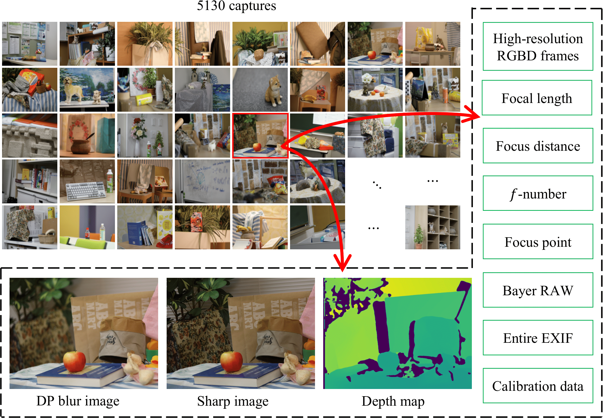
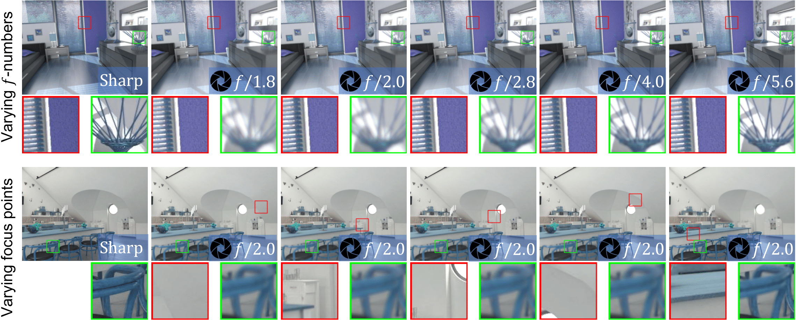

# Neural-DP-Simulator
Code &amp; Dataset release for the ICCP'23 paper: Learning to Synthesize Photorealistic Dual-pixel Images from RGBD frames

## TODO:
1. We are cleaning the dataset now and will release it asap

## Dataset

* Each timestamp-named folder refers to one scenario. Within it:
    * `meta_data.h5` records various info such as focal length, focus distance, and calibration data
    * `cam0` and `cam1` contain the RGB DP images and depth maps of the left-right cameras, respectively. All RGB images are saved in 16-bit format. The depth maps are also saved in 16-bit format in mm unit. 

* `data_processing/` contains the code we used for processing the data acquired from camera. 

## Our simulator

`our_simulator/` contains the code for training & testing & inferring using our DP-Simulator 

<!-- ## Citation -->

